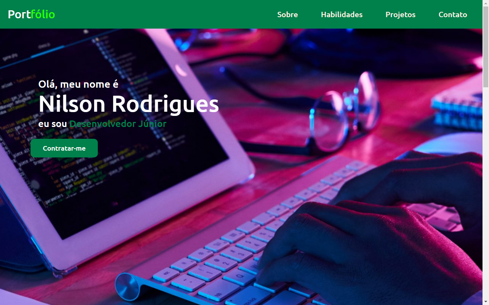

<h1 align='center'>Portfólio</h1>

 

<a href='https://evanilsonpg.github.io/Site-Portfolio-1/'>Clique aqui e veja o Portfólio --></a>

 

<h2 align='center'>Descrição</h2> 

**Portfólio** criado baseado no que aprendi ultilizando as tecnologias **HTML, CSS & JAVASCRIPT** .

 

<h2 align='center'>Sobre</h2>

No **Portfólio** Contém a página de início onde está meu nome e tbm possui o botão de me contrar onde irá abrir o seu email para contato, logo abaixo uma descrição sobre mim. Na parte de projetos criados estão os projetos em que demorei mais tempo para poder criá-lo e por fim uma aba para contato!
 
 

### **Tecnologias usadas** ->
 

- [HTML]()
- [CSS]()
- [JAVASCRIPT]()
